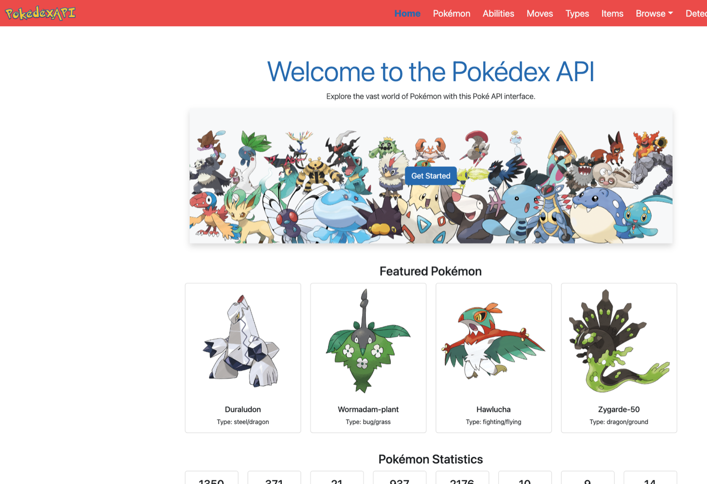
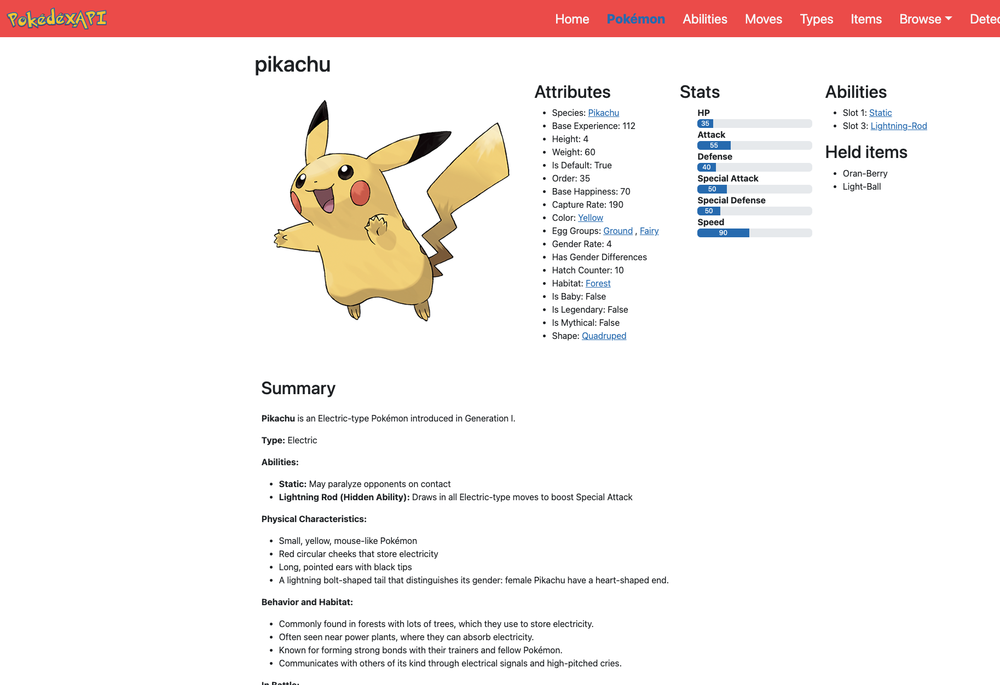

# Pokédex Web Application

A Flask-based Pokédex that surfaces Pokémon, moves, items, locations, and more from [PokéAPI](https://pokeapi.co/), with Redis and shelve caching and optional AI-generated summaries.

## Screenshots

<p align="center">
  
</p>

<p align="center">
  
</p>

## Quick Start (Docker)

```bash
git clone https://github.com/joereg4/pokeAPI.git
cd pokeAPI
cp .env.example .env
# Edit .env before any non-throwaway use:
#   FLASK_ENV=production
#   SECRET_KEY=<long random string>
docker compose up --build
```

> **Security:** Docker Compose defaults to `FLASK_ENV=production`, which requires a real `SECRET_KEY` in `.env`. The example value is only for local experimentation — generate a strong secret for anything beyond a quick trial.

Open **http://localhost:8080**. See [DEPLOYMENT.md](DEPLOYMENT.md) and [docker/README.md](docker/README.md).

On first start, the app entrypoint runs migrations and **imports AI summaries from `static/resources/*.csv`** when the `resources` table is empty (includes Pikachu and the rest). Create an admin user for the dashboard:

```bash
docker compose run --rm app python manage.py create_user
```

## Quick Start (local Python)

```bash
python3 -m venv .venv
.venv/bin/pip install -r requirements.txt
cp .env.example .env
# Start Postgres + Redis; set DATABASE_URL and REDIS_URL in .env
.venv/bin/flask db upgrade
.venv/bin/python scripts/seed_resources_if_empty.py
.venv/bin/python manage.py create_user
.venv/bin/python app.py
```

Open **http://127.0.0.1:5000**.

---

## Table of Contents

1. [Features](#features)
2. [Technology Stack](#technology-stack)
3. [Setup](#setup)
4. [Running the Application](#running-the-application)
5. [Project Structure](#project-structure)
6. [Caching System](#caching-system)
7. [Database Management](#database-management)
8. [Testing](#testing)
9. [Contributing](#contributing)
10. [License](#license)

---

## Features

- Detailed information on Pokémon, including stats, abilities, and evolutions
- Data on locations, items, berries, and more from the Pokémon universe
- Efficient two-level caching system for improved performance
- Modular design with Flask blueprints
- Comprehensive test suite

## Technology Stack

- Flask: Web framework
- Python 3.9+: Programming language
- PokéAPI: Primary data source
- Flask-Caching: High-level caching for route responses
- Shelve: Low-level caching for Pokédex-specific data
- PostgreSQL + Redis: Persistence and route cache (production and Docker)
- Markdown: Text-to-HTML conversion for summaries

## Setup

### Prerequisites

- **Docker path:** Docker and Docker Compose
- **Local path:** Python 3.9+, PostgreSQL, Redis

### Installation

1. **Clone the repository**
   ```bash
   git clone https://github.com/joereg4/pokeAPI.git
   cd pokeAPI
   ```

2. **Configure environment**
   ```bash
   cp .env.example .env
   # Edit .env — set SECRET_KEY at minimum
   ```

3. **Choose a run mode**
   - **Docker (recommended):** `docker compose up --build` — see [docker/README.md](docker/README.md)
   - **Local Python:**
     ```bash
     python3 -m venv .venv
     source .venv/bin/activate   # Windows: .venv\Scripts\activate
     .venv/bin/pip install -r requirements.txt
     .venv/bin/flask db upgrade
     ```

### Redis

Set `REDIS_URL` in `.env` (default `redis://localhost:6379/0`). Docker Compose provides Redis automatically.

## Running the Application

**Docker:** http://localhost:8080 after `docker compose up`

**Flask dev server:**
```bash
.venv/bin/python app.py
```

## Project Structure

See repository layout: `routes/` (blueprints), `pokedex/` (API client and cache), `models/`, `templates/`, `tests/`.

## Caching System

- **High-level:** Flask-Caching with Redis for route responses
- **Low-level:** Shelve filesystem cache for raw PokéAPI payloads

## Database Management

> **Optional operator tools** — for syncing summaries with a remote Postgres over SSH. Not needed for Docker or local dev.

Scripts (require `PROD_SSH_HOST` in `.env` if you use a remote server):

- **`scripts/upload_pokemon_summaries.py`** — Upload resource summaries to a remote database
- **`scripts/backup_db.py`** — Remote database backup and restore
- **`scripts/interactive_summary_updater.py`** — Review and update summaries

### Quick Start (remote server)

1. **Install dependencies**
   ```bash
   .venv/bin/pip install -r requirements.txt
   ```

2. **Establish SSH tunnel** (set `PROD_SSH_HOST` in `.env` first)
   ```bash
   ssh -L 5433:localhost:5432 ${PROD_SSH_USER:-root}@${PROD_SSH_HOST:?set PROD_SSH_HOST in .env}
   ```

3. **Upload summaries (example)**
   ```bash
   python3 scripts/upload_pokemon_summaries.py \
     --resource pokemon \
     --host localhost \
     --port 5433 \
     --database pokeapi \
     --user pokeapi \
     --password "your_password"
   ```

For details, see [Database Management Guide](docs/database_management.md) and [Interactive Summary Updater Guide](docs/interactive_summary_updater.md).

Historical UI notes: [docs/CHANGELOG-ui.md](docs/CHANGELOG-ui.md).

## Testing

```bash
.venv/bin/pytest tests/ -q -m "not integration"
```

See [CONTRIBUTING.md](CONTRIBUTING.md) for CI and PR guidelines.

## Contributing

Contributions welcome — see [CONTRIBUTING.md](CONTRIBUTING.md).

## License

MIT — see [LICENSE](LICENSE). Security reports: [SECURITY.md](SECURITY.md).
